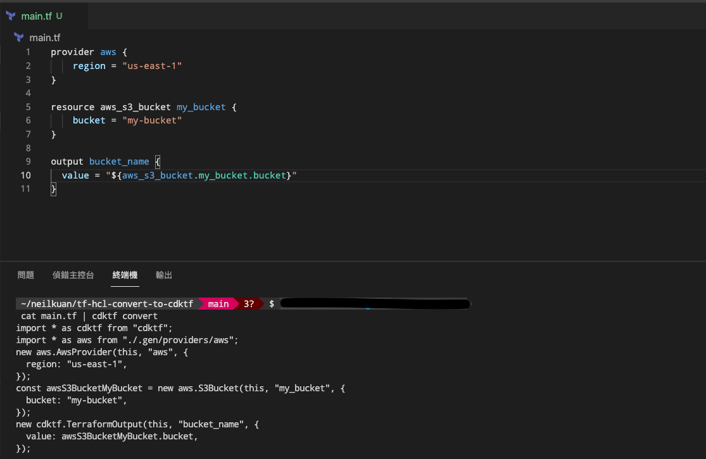

# tf-hcl-convert-to-cdktf

- [ ] cdktf version `0.5.0`

## Terraform
```bash
terraform init

terraform plan

terraform apply

terraform destroy
```

## Convert HCL to TypeScript(cdktf code).
```bash
cat main.tf | cdktf convert
```
